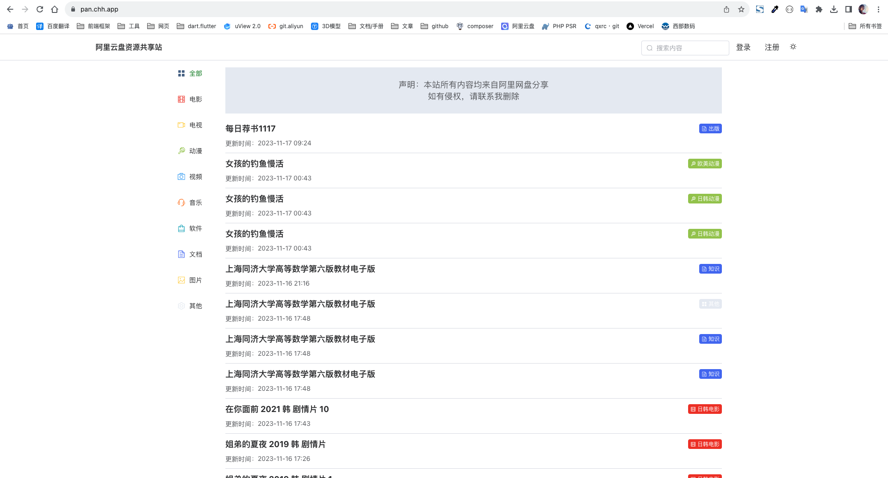

# 阿里网盘资源共享站

前端用的是 Element-plus, 就简单的一个页面

数据库在 ./README/Data.db



记得修改 src/components/layouts/MainContent.vue 里的 api 地址


## Project setup

```bash
npm install
```

### Compiles and hot-reloads for development

```bash
npm run dev
```

### Compiles and minifies for production

```bash
npm run build
```


### Custom theme

See `src/styles/element/index.scss`.
